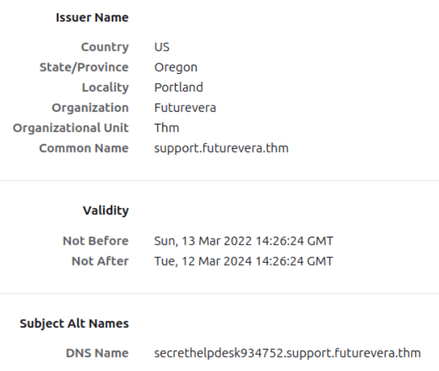
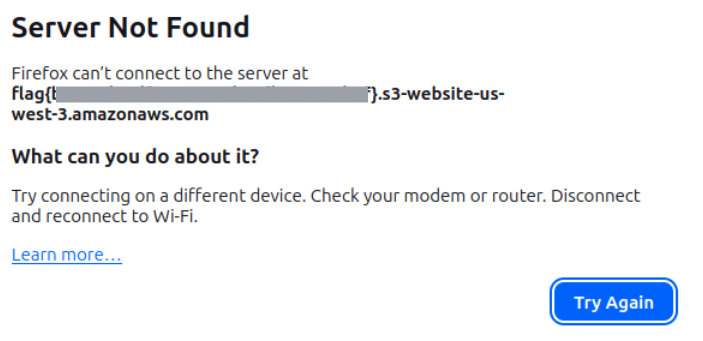

# TakeOver
> Sala para practicar habilidades de enumeración

**URL:** https://tryhackme.com/room/takeover

## Resumen

Se realizaron pruebas de reconocimiento y enumeración obteniendo información de subdomonios, hosts virtuales y detalles en los certificados. Esto puede conducir a un reconocimiento más profundo utilizando ingeniería social, por lo cual es recomendable mantener acceso a la información privada solo desde la intranet

---

## Metodología

### Reconocimiento

El escaneo inicial muestra los siguiente resultados

```bash
$ nmap -n -Pn [TARGET]

PORT      STATE SERVICE
22/tcp    open  ssh
80/tcp    open  http
443/tcp   open  https
```

### Enumeración

Para acceder a la pagina futurevera.thm y realizar la enumeración de manera correcta es necesario modificar el archivo /etc/hosts para que la dirección IP objetivo se pueda resolver

```bash
$ sudo nano /etc/hosts
127.0.0.1	localhost
[TARGET]	futurevera.thm
```

Se realizaron 3 intentos de enumeración. El primero en busca se direcotrios, el segundo para subdominios y el tercero para hosts virtuales, este último tuvo éxito.

```bash
$ ffuf -u https://[TARGET] -w /usr/share/wordlists/SecLists/Discovery/DNS/subdomains-top1million-20000.txt -H "Host: FUZZ.futurevera.thm" -fs 4605

        /'_\  /'_\           /'_\       
       /\ \_/ /\ \/  _  _  /\ \_/       
       \ \ ,_\\ \ ,\/\ \/\ \ \ \ ,_\      
        \ \ \/ \ \ \/\ \ \\ \ \ \ \/      
         \ \\   \ \\  \ \_/  \ \\       
          \//    \//   \/_/    \/_/       

       v2.1.0
________________

 :: Method           : GET
 :: URL              : https://[TARGET]
 :: Wordlist         : FUZZ: /usr/share/wordlists/SecLists/Discovery/DNS/subdomains-top1million-20000.txt
 :: Header           : Host: FUZZ.futurevera.thm
 :: Follow redirects : false
 :: Calibration      : false
 :: Timeout          : 10
 :: Threads          : 40
 :: Matcher          : Response status: 200-299,301,302,307,401,403,405,500
 :: Filter           : Response size: 4605
________________

blog                    [Status: 200, Size: 3838, Words: 1326, Lines: 81, Duration: 3ms]
support                 [Status: 200, Size: 1522, Words: 367, Lines: 34, Duration: 7ms]
:: Progress: [19983/19983] :: Job [1/1] :: 1626 req/sec :: Duration: [0:00:25] :: Errors: 0 ::
```

Consulte apéndice para los dos primeros intentos

Igualmente, es necesario poner los subdomonios que utilizan host virtual en el archivo /etc/hosts.

```bash
$ sudo nano /etc/hosts
127.0.0.1	localhost
[TARGET]	futurevera.thm support.futurevera.thm blog.futurevera.thm
```

### Explotación

Se comprobaron datos de los certificados de ambas páginas web y se encontró el siguiente nombre alternativo en support.futurevera.thm



La entrada a la pagina web es la siguiente.



Muestra la bandera

En esta ocasión no es necesario agregar la URL al archivo /etc/hosts, basta con acceder a la pagina web a través del navegador

----

## Impacto

Al poseer certificados desactualizados es posible realizar un seguimiento del historial administrativo de la página web, es decir, obtener información de quién hizo un cambio, cuándo se realizó y qué entidad estuvo involucrada. Esto puede conducir a ingeniería social diriga a personas internas y externas de la organización pudiendo revelear información privada.

----

## Recomendaciones

- Acceso a sitios privados solo desde la intranet 
- Mantener siempre actualizado los certificados
- Seguimiento de modificaciones realizadas en la pagina web, certificados, llaves, encargados del proyecto, etc.

----

## Aprendizajes 
### Ofensivo
- Enumerar objetivo por directorios, subdominios y virtual host
- Explorar recursos utilizados por la página web

### Defensivo
- Permitir acceso a paginas web privadas solo desde la intranet
- Configurar tazas mínimas y máximas de solicitudes por segundo para mitigar escaneos, reconocimiento y fuerza bruta.

## Apéndice

Primer intento en busca de directorios utilizando _gobuster_

```bash
$ gobuster dir -u https://futurevera.thm -w /usr/share/wordlists/SecLists/Discovery/Web-Content/directory-list-2.3-medium.txt 
```

No se encontraron resultados relevantes

Segundo intento en busca de subdominios utilizando _gobuster_

```bash
$ gobuster dns -d futurevera.thm -w /usr/share/wordlists/SecLists/Discovery/DNS/subdomains-top1million-110000.txt 
```